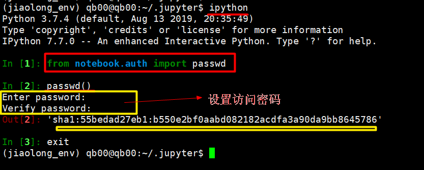

[TOC]

## 1.生成密码

- 输入 ipython

  >from notebook.auth import passwd 
  >
  >passwd() 
  >
  > exit

### 设置输出秘钥

- c.NotebookApp.password = u'sha1:55bedad27eb1:b550e2bf0aabd082182acdfa3a90da9bb8645786'

## 2.查询配置文件位置

> jupyter notebook --generate-config

## 3. 修改 jupyter_notebook_config.py

c.NotebookApp.ip='*'
c.NotebookApp.password =  u'sha1:55bedad27eb1:b550e2bf0aabd082182acdfa3a90da9bb8645786'
c.NotebookApp.open_browser = False
c.NotebookApp.port =8888

## 4.参考地址

[远程访问Jupyter Notebook](https://blog.csdn.net/simple_the_best/article/details/77005400)

