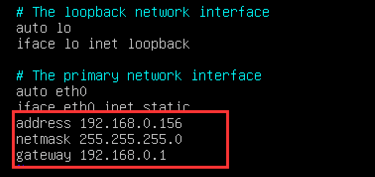

[TOC]

## Ubuntu 设置

### ubuntu切换用户

> sudo su

> su - jiaolong

### 重新安装vim

> sudo apt install vim

### 安装lrzsz

- sudo apt-get install lrzsz -y

  > rz 上传、sz 下载

###  重新安装ssh

- 安装ssh

> sudo apt-get install openssh-server

- 启动ssh

> sudo /etc/init.d/ssh start 
>
> service ssh start

### 安装ifconfig和ping

apt-get install net-tools

apt-get install iputils-ping

### 配置IP

	vim /etc/network/interfaces

- 修改DNS

  > sudo vim /etc/systemd/resolved.conf
  >
  > DNS=8.8.8.8  114.114.114.114

- 重启网络 

  > sudo /etc/init.d/networking restart

### 防火墙操作

- 查看状态

  > sudo ufw status

- 开启防火墙

  > sudo ufw enable

- 关闭防火墙

  > sudo ufw disable

## CentOS7配置

### CentOS7 配置IP

- vim  /etc/sysconfig/network-scripts/ifcfg-eth0   

  > BOOTPROTO=static   #启用静态IP地址
  >
  > ONBOOT=yes  #开启自动启用网络连接
  >
  > IPADDR=192.168.21.129  #设置IP地址
  >
  > NETMASK=255.255.255.0  #设置子网掩码
  >
  > GATEWAY=192.168.21.2   #设置网关
  >
  > DNS1=8.8.8.8 #设置主DNS
  >
  > DNS2=8.8.4.4 #设置备DNS
  >
  > IPV6INIT=no  #禁止IPV6

  :wq!  #保存退出

- 关闭防火墙

  > systemctl stop firewalld.service          #停止firewall
  >
  > systemctl disable firewalld.service     #禁止firewall开机启动
  >
  > firewall-cmd --state                               #查看防火墙状态

### 参考

- [Ubuntu IP地址修改](https://blog.csdn.net/qq_36937342/article/details/80876385)
- [CentOS7关闭防火墙](https://www.cnblogs.com/yyxq/p/10551274.html)

