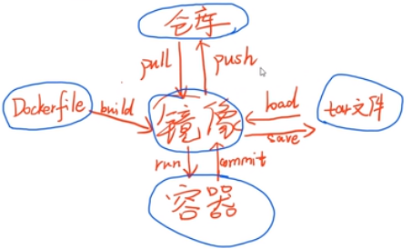
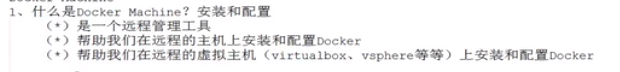
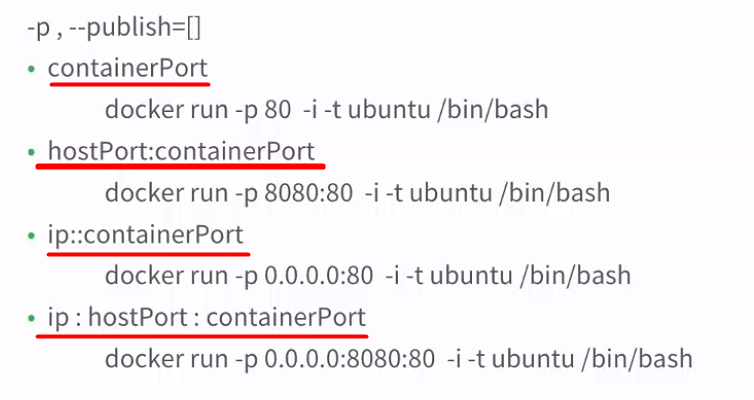

[TOC]

# 整体流程

## 加速器查询

docker info  

> 通过查看Registry Mirrors信息，来确定加速器地址

[阿里云Docker镜像仓库使用说明](http://note.youdao.com/noteshare?id=aaa8bf4e9e3a66e3b10548bb4011d8e9&sub=EB92CF3C44B948A6980CCE40AFE6D0AE)

# 开启Docker 容器

- 查看docker进程

  > ps -ef |grep docker

- 启动、停止、重启docker进程

  > service docker start
  >
  > service docker stop
  >
  > service docker restart

# 容器

## 运行容器

- docker run -d --name=jl_docker110 -it ubuntu /bin/bash

  > --name  #指定容器名称
  >
  > -it        #表示是交互式容器
  >
  > -d          #是已后台的方式运行程序，当程序运行结束后，仍然会停止
  >
  > -P    # 为容器暴露的所有端口进行映射
  >
  > -p    #指定容器的端口进行映射

  

- sudo service docker restart   # 重启docker
- docker run ubuntu echo "hello world" #测试docker
- docker run hello-world

## 查询容器

- docker ps    #查询正在运行的容器
- docker ps -al  # -a 查询所有创建的容器 ，-l 最细的容器
- docker inspect 容器名  # 查询指定容器信息
- docker start [-i] 容器名   #重启启动容器，-i表示 已交互的方式
- docker rm 容器名
- docker ps -aq  # 查询所有容器ID

## 查看容器端口

​	docker ps

​	docker port 容器名

## 进入容器

- docker attach 容器名  #进入后台运行的容器
- Ctrl+P  Ctrl+Q              #退出后台运行的容器

## 停止容器

- docker start -i 容器名     #启动容器
- docker stop 容器名 		#停止容器
- docker rm 容器名	        #删除容器
- docker rm -f  容器名        # 强制删除
- docker start  [-i] 容器名        # 开启容器,-i表示已交互式启动

## 查看容器内进程

- docker top 容器名                                #查看容器内进程

- docker logs -tf --tail 0 容器名              #查看容器运行的日志信息

  > docker run --name jl-doc -d ubuntu /bin/sh -c "while true ; do echo hello world; sleep 1; done"

- docker exec  -itd  容器名 执行命令     #在运行的容器内启动新进程

  > docker exec  -i -t  jl-doc /bin/bash

- docker exec web nginx

  > 在容器名为web的容器中，启动nginx
  >
  > [docker exec 命令](https://www.jianshu.com/p/d858d3cfd427)

# 镜像

## 镜像操作

- docker images                             #查询所有镜像
- docker images 镜像名                 #查询指定镜像
- docker rmi 镜像名称                    #删除镜像

## 镜像上传与下载

- docker pull 仓库名:标签名
- docker push 仓库名:标签名

## 创建镜像

 - docker commit -a=“作者信息”  -m "镜像信息"  容器名称  仓库名:版本号

# 参考文章

1.[Docker快速入门](https://www.cnblogs.com/williamjie/p/9103327.html)

2.[Docker教程](https://www.bilibili.com/video/av17854410/?p=3)

3.[Docker命令-官网](https://docs.docker.com/engine/reference/run/)

