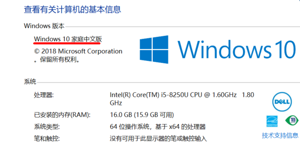

[TOC]

## Win10 环境



## 开启Hyper-V

新建`hyperv.cmd`文件，内容如下：

```
pushd "%~dp0"

dir /b %SystemRoot%\servicing\Packages\*Hyper-V*.mum >hyper-v.txt

for /f %%i in ('findstr /i . hyper-v.txt 2^>nul') do dism /online /norestart /add-package:"%SystemRoot%\servicing\Packages\%%i"

del hyper-v.txt

Dism /online /enable-feature /featurename:Microsoft-Hyper-V-All /LimitAccess /ALL
```

以管理员身份执行`hyperv.cmd`文件。


## 禁用Hyper-V

- [vmware workstations与device/credential不兼容](https://jingyan.baidu.com/article/da1091fb780e48027949d610.html)

- [Win10系统下提示VMware与Device/Credential Guard不兼容如何解决](http://www.win7zhijia.cn/win10jc/win10_20680.html)

-  [win10家庭版通过命令gpedit.msc打不开组策略的解决方法](https://www.cnblogs.com/zhaozhg/p/10460595.html)

- 重启电脑


## 注意

	> docker win10安装影响 VMware 的运行，VMware 需要禁止Hyper。


## 参考文章

1. https://www.cnblogs.com/samwu/p/10360943.html
2. https://blog.csdn.net/hunan961/article/details/79484098
3. [Install Docker Toolbox on Windows](https://docs.docker.com/toolbox/toolbox_install_windows/)

