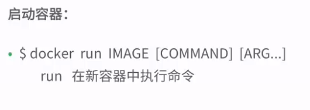
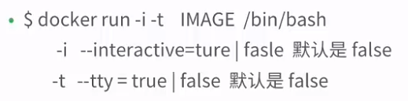

### 建立一个容器

> docker run ubuntu echo "hello world"

### 交互式容器使用

docker run -i -t ubuntu /bin/bash

### 查看容器

- 查看容器

  docker ps [-a] [-l]

  > -a 所有，-l最新创建

  > docker ps 表示查询正在运行的容器

- 查看指定容器信息

  > docker inspect cd437020245e 
  >
  > cd437020245e是 容器名字

### 自定义容器名

- docker run --name=jiaolong_docker -i -t ubuntu /bin/bash

- docker run --name=jiaolong_docker  -it ubuntu /bin/bash

  > 创建名为jiaolong_docker的容器。
  >
  > exit用于退出bash终端

- docker ps -a

- docker inspace jiaolong_docker

### 重新启动停止容器

- docker start [-i] 容器名

  > 重启启动容器，-i表示 已交互的方式

- docker rm 容器名

  > 删除停止的容器

### 总结

- docker run -i -t --name

- docker ps [-a] [-l]

- docker inspect 容器名

- docker start -i 容器名

- docker rm 容器名

  > 可一次删除多个容器 ，容器名之间用空格分割