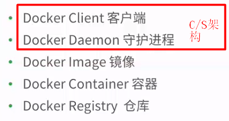
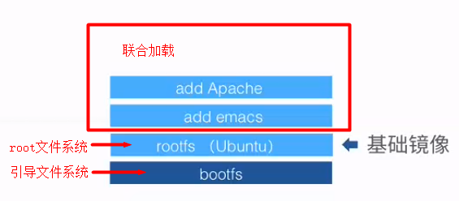
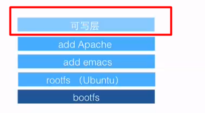
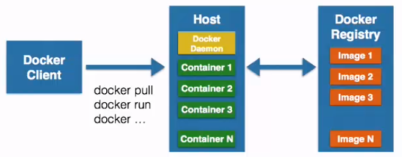
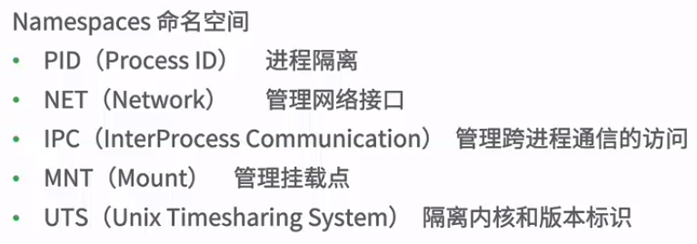
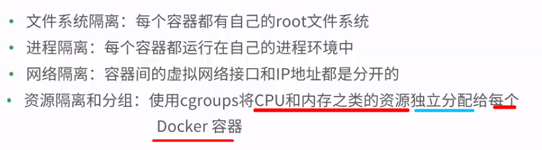
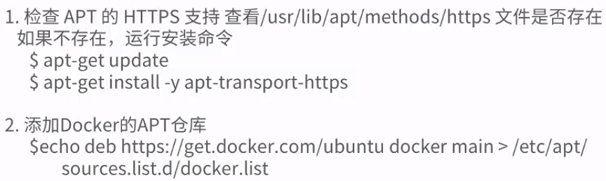
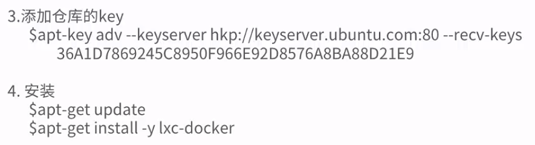

[TOC]

### 虚拟机与容器的区别

- 传统虚拟机通过中间层将一台或多台独立的机器，虚拟运行于物理硬件之上，

- 容器是运行在操作系统内核之上的用户空间,因此容器可称为 操作系统级 虚拟化

### Docker能干什么？

- Docker 可以将 应用程序 `自动部署 `到 容器

### Docker基本组成

1. docker 是一个C/S架构

2. docker image是镜像，可以理解为docker 的源代码或一个小型操作系统，保存了 启动容器的 各种条件，docker镜像其实是一个 层叠的只读文件系统

3. 容器

   容器通过镜像启动，同事可运行多个进程。容器是在`可写层`操作，采用写时复制策略

   

4. 仓库

   ​	仓库用来保存构建的镜像，仓库分公有和私有，公有仓库有Docker Hub

### 容器相关技术

#### Namespaces 命名空间

#### Control groups (cgroups)控制组

- 主要作用是用来分配资源，例如资源限制、资源控制、资源计量和优先级设定

- Docker容器的能力

  

### Docker安装

#### 1. Ubuntu 维护的版本安装

- 在Ubuntu中安装前检查
  - 内核版本                                     uname -a
  - 检查Device Mapper                   ls -l /sys/class/misc/device-mapper

- 安装

  > sudo apt-get install docker.io
  >
  > source /etc/bash_completion.d/docker.io
  >
  > sudo docker.io version

#### 2. Docker 维护的版本安装

**简易安装方式**

- whereis curl 

  > 检查curl是否被安装

- 安装curl

  > sudo apt-get install -y curl

- 安装docker

  > curl -sSL https://get.docker.com/|sudo sh

- 查看安装版本

  > sudo docker version

- 运行docker

  > sudo docker run ubuntu echo "hello world"

#### 3. 不使用root权限运行docker命令

- 创建组名为docker的组

  > sudo groupadd docker   

- 将用户名jiaolong用户添加到docker组中

  > sudo gpasswd -a jiaolong docker

- 重启服务

  > sudo service docker restart

- 不使用sudo进行测试

  > docker run hello-world

#### 4. docker 卸载

> sudo apt-get remove docker docker-engine docker.io docker-ce
>
> apt-get remove docker
> apt remove docker-ce

