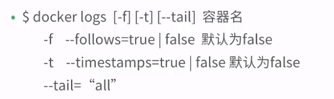

[TOC]

### 什么是守护式容器

- 能长期运行

- 没有交互式会话

- 适合运行应用程序和服务

  

### 以守护式方式运行容器

- docker run -i -t ubuntu /bin/bash

  >  运行交互式容器

- 退出交互式容器，并在后台运行，顺序不能错

  > Ctrl+P  Ctrl+Q 

### 进入指定守护式容器

> docker attach 容器名

### 创建守护式启动容器

> docker run -d IMAGE [COMMAND] [ARG...]
>
>  -d 是已后台的方式运行程序，当程序运行结束后，仍然会停止。

### 查看容器日志

> --tail ="10"表示返回结尾处多少数量的日志，不指定将返回所有的日志.

案例：

- docker run --name jl-doc -d ubuntu /bin/sh -c "while true ; do echo hello world; sleep 1; done"

  > 在后台运行容器

- docker logs -tf --tail 0 jl-doc

  > 查看容器内部运行情况，--tail 0表示查询最新的日志信息

- docker top 容器名

  > 查看容器内进程

### 在运行终端容器内启动新进程

- docker exec  -i -t  jl-doc /bin/bash

### 停止守护式容器

- docker stop 容器名

- docker kill 容器名

### 总结

### 帮助文档

