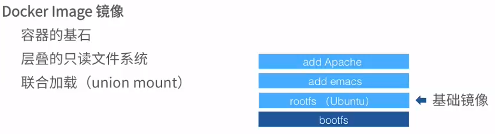
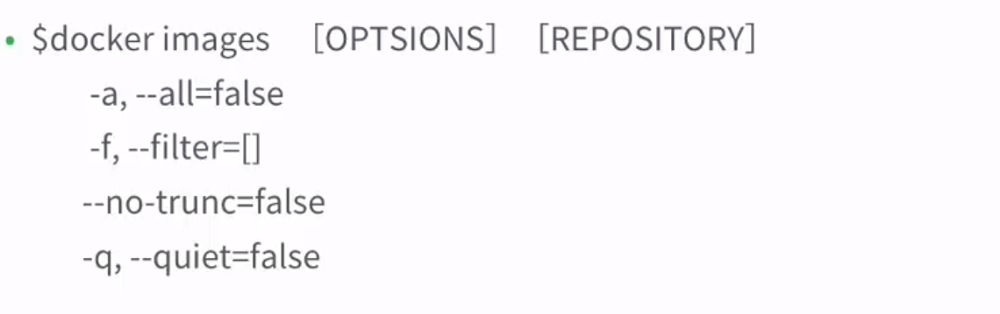
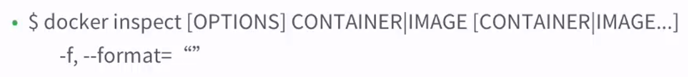

[TOC]

- docker info 

> 查询docker信息
>
> 可以查询到docker存储在 /var/lib/docker目录中

### 列出镜像

- docker images  #查询已安装的镜像

- docker images 仓库名

  > 这里的仓库名是docker images命令下的仓库名称

### 查看镜像信息

> docker inspect 镜像名

### 删除镜像

- 删除所有镜像

  > docker rmi $(docker images 仓库名 -q)

