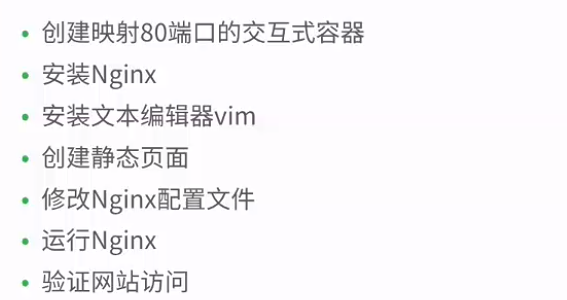
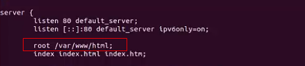
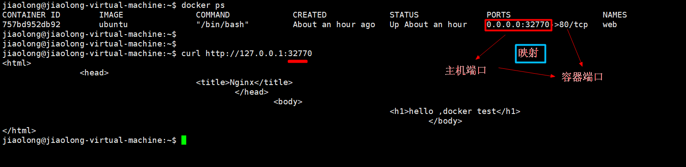

[TOC]

## Nginx部署流程



- -p说明

  

  

  

## 创建Nginx容器

1. 启动一个80端口的容器，容器名是web, 是一个交互式容器

   > docker run -p 80 --name=web -it ubuntu /bin/bash

2. 容器内安装

   - 安装nginx

     > apt-get update
     >
     > apt-get install -y nginx
     >
     > apt-get install -y vim 

   - 创建html

     >mkdir -p /var/www/html
     >
     >cd /var/www/html
     >
     >vim index.html
     >
     >```
     ><html>
     ><head>
     >	<title>Nginx</title>
     ></head>
     ><body>
     >	<h1>hello ,Docker Nginx Test</h1>
     ></body>
     ></html>
     >```
     >
     >

   - 设置html存放路径

     > whereis nginx 	#查找安装nginx路径
     >
     > vim /etc/nginx/sites-enabled/default 	#设置html存放路径
     >
     > exit #退出容器




3. 启动nginx

   ​	nginx  

- 查找容器IP

  > docker inspect web | grep IPAddress
  >
  > curl http://172.17.0.2 # 直接访问ip,不用加端口

- 访问nginx页面

  > curl http://127.0.0.1:32770

  


## 重启启动容器

- docker stop web  #停止容器

- docker start -i web #启动容器

  > ps -ef  # 查询进程，发现nginx 没有启动

  

- 启动web容器的nginx服务

  > docker exec web nginx  

- 查看web容器进程

  >  docker top web 

