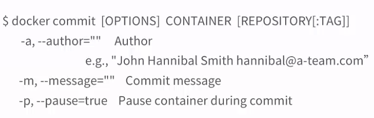
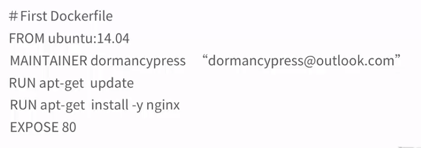

[TOC]

## docker commit 通过容器构建

### 案例：

- docker run -it -p 80 --name commit_test ubuntu /bin/bash

- 容器内操作：

  ​	 apt-get update

   	apt-get install -y nginx

   	exit

- **将容器转为镜像(创建镜像)**

  docker commit -a "jiaolong" -m"nginx" 容器名  仓库名/镜像名

  > docker commit -a 'jiaolong' -m 'nginx'  commit_test jl_docker_test:1.0

- docker images  #查看镜像

- 使用创建的镜像启动容器

  > docker run -d  --name=nginx_web   -p 80 jl_docker_test:1.0 nginx -g "daemon off;"

  > nginx -g "daemon off;"  #指定nginx以前台模式运行

- 阿里云提交镜像

  > sudo docker login --username=jiaolong1234567@126.com registry.cn-beijing.aliyuncs.com
  > sudo docker tag [ImageId] registry.cn-beijing.aliyuncs.com/jiaolong_images/docker_test:[镜像版本号]
  > sudo docker push registry.cn-beijing.aliyuncs.com/jiaolong_images/docker_test:[镜像版本号]

- 案例

  > sudo docker tag 46c320cbd401 registry.cn-beijing.aliyuncs.com/jiaolong_images/docker_test:1.0
  >
  > sudo docker push registry.cn-beijing.aliyuncs.com/jiaolong_images/docker_test:1.0
  >
  > 

## docker build  通过Dockerfile文件构建

- 创建第一个Dockerfile

- vim Dockerfile

  >FROM ubuntu:14.04
  >MAINTAINER jiaolong "jiaolong@qq.com"
  >RUN apt-get update
  >RUN apg-get install -y nginx
  >EXPOSE 80
  >
  >或
  >
  >FROM ubuntu:14.04
  >MAINTAINER jiaolong "jiaolong@qq.com"
  >RUN apt-get update  &&  apg-get install -y nginx
  >EXPOSE 80

​     **注意文件名必须是Dockerfile**

- docker build -t='web:nginx.2.1' .

  > -t 表示设置镜像名称
  >
  > . 表示当前目录

- docker images
- docker run -d --name nginx_web_jl -p 80 web:nginx.2.1  nginx -g "daemon off;"

